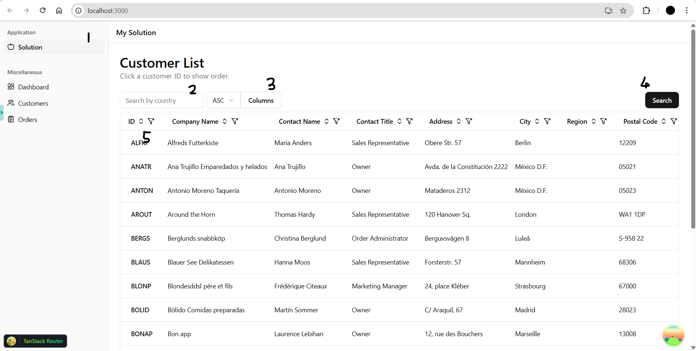
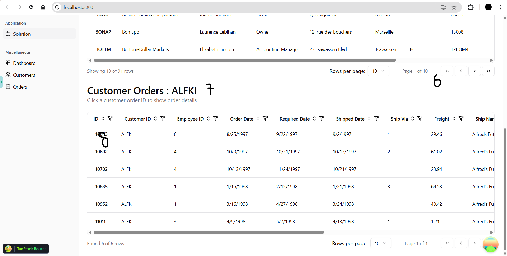
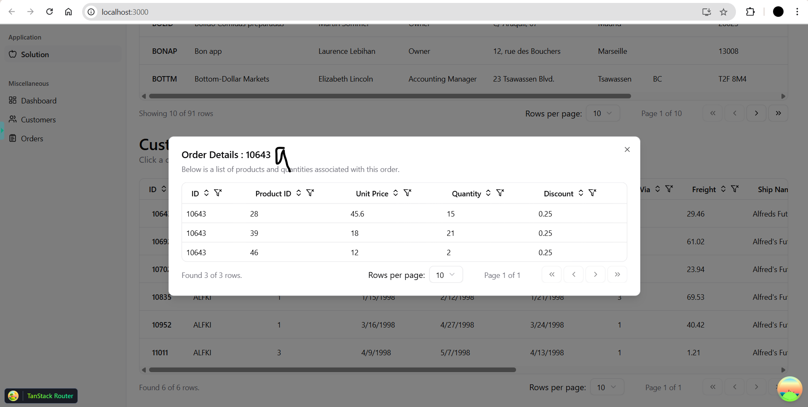

# Table of Contents

- [🚀 Getting Started](#-getting-started)
  - [🎨 Styling](#-styling)
  - [🧩 UI Components](#-ui-components)
    - [🧭 Routing](#-routing)
    - [🔄 Data Fetching](#-data-fetching)
    - [📊 Data Table](#-data-table)
    - [🧠 State Management](#-state-management)
- [📁 Project Overview](#-project-overview)
  - [🧪 API Usage](#-api-usage)
  - [🖼️ Solution Preview](#️-solution-preview)

# 🚀 Getting Started

To run this application locally:

```bash
npm install
npm run start  
```

## 🎨 Styling

This project uses [Tailwind CSS](https://tailwindcss.com/) for utility-first styling, allowing for rapid and responsive UI development.

## 🧩 UI Components

UI components are built with [Shadcn](https://ui.shadcn.com/), a customizable and modern component library.  
You can find all reusable UI components in:

```bash
src/components/ui
```

## 🧭 Routing

Routing is handled using [TanStack Router](https://tanstack.com/router), configured with a file-based approach.  
All routes are located under:

```bash
src/routes
```

## 🔄 Data Fetching

The project uses [TanStack Query](https://tanstack.com/query/latest) for data fetching and caching.  
Fetching logic and hooks are located in:

```bash
src/features
```

## 📊 Data Table

We use [TanStack Table](https://tanstack.com/query/table) to build powerful tables that support:

- Sorting
- Filtering
- Server-side pagination

This enables scalable and interactive data tables out-of-the-box.

## 🧠 State Management

State is managed using [React Redux](https://react-redux.js.org/). Redux is used to handle:

- UI states (e.g., active sidebar menu)
- Dialog/modal visibility and related data
- Query parameters and pagination states

Redux logic and slices are located in:

```bash
src/redux
```

# 📁 Project Overview

The **main solution** is implemented in the route:

```bash
src/routes/index.tsx
```

Relevant components for the final implementation can be found in:

```bash
src/components/solution
```

> ⚠️ **Note:** Other routes and components in this repository were part of previous approaches and can be ignored. After identifying the correct requirements and behavior, only the above files are used in the final solution.

## 🧪 API Usage

- ✅ `QueryCustomers` — Fetches all customers or a filtered/sorted list.
- ✅ `GetOrders` — Retrieves order details by `customerId`.

> 🚫 `QueryOrders` was not used because it only accepts `freight` as a parameter, which is not sufficient to fetch meaningful order data.

## 🖼️ Solution Preview

### 1. Customer List View



1. Ensure you're on the correct menu — `Solution`, marked with an apple icon.
2. Filter results by typing in country names or any partial string. Leave it empty to retrieve all records.
3. Choose the sort direction (`asc` or `desc`) and the column you want to sort.
4. Click the **Search** button to fetch data.
5. Click a `customerId` to view the customer's order details below.

### 2. Order Details View


6. Server-side pagination is implemented — loading new pages might take a moment.
7. The selected `customerId` remains visible for easy tracking.
8. Click on an `orderId` to display the specific order details.

### 3. Individual Order Detail View


9. The selected `orderId` is displayed at the top, with the full order information shown beneath.
